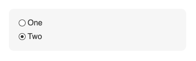
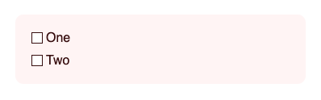
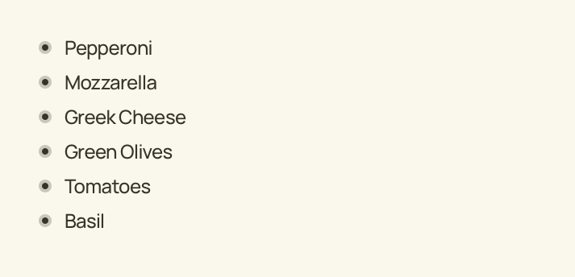
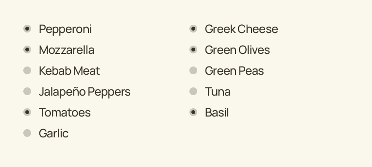

When building a form – and expecting a user to fill it – the most important thing is ease of use and recognizability. 

Some time ago, in mid 2000s, Internet Explorer 6 and 7 were serious players. And I mean serious, every product had to be compatible with those guys. The Microsoft boys were really hustlin’, and every front-end developer knew that. 

There was this one thing no `/9` or `!important` couldn’t fix. It was the `input[radio]` and `input[checkbox]` fields. Styling those was practically impossible, as they never allowed any tinkering in properties other than border. 

Of course, aesthetic-hungry _webmasters_ developed a lot of JavaScript (most of the time in a form of jQuery plugin) that allowed to style the input however we wanted. But there were tradeoffs. Hard, often limited, development. Lack of accessibility. Requiring JavaScript (and back then, it wasn’t so obvious.) So the forms remained mostly untouched, and it was good.

And then, standardization came. Internet Explorer lost its significance. Suddenly, styling `input[radio]` wasn’t that impossible. We all used the _`:before` trick_. It allowed us to do something like this:

<figure></figure>

Not fancy enough? So, why don’t we break it?

<figure></figure>

([See it live](https://codepen.io/tomekbuszewski/pen/ExjRRjP?editors=0110).)

You see where I am going with this overlong exposure?

Such examples were very common back then. Round checkboxes and square radios. But I thought this was all left in the past, where poor interfaces prevailed.

But they are still here.

I got the munchies recently and decided to order a pizza via Internet. There is one I particularly like, it allows picking own ingredients. So I basically make the „Greek” pizza I ate when I was a kid. Form, more or less, looks like this:

<figure></figure>

See the problem? If yes, congratulations, if no, let me play in Sketch some more:

<figure></figure>

Now you see? All of this items look like `radio` buttons, while in reality, those are `checkbox` types.

<figure></figure>

This is not a _design_ choice. No, design is making it more appealing while keeping the usability intact. This is a mistake. Done perhaps by someone with less experience in the field, but nevertheless, a mistake. Know better. Don’t commit such mistakes.

—

Rounded `input[radio]` and square `input[checkbox]` is something all users know for a long time. Those were the first „tick” fields we saw, probably somewhere in Windows settings panel. They were there, when first web pages that allowed actually doing something other than reading, hit the ‚net. And now they are here, and please, make them stay.